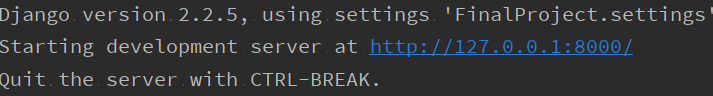
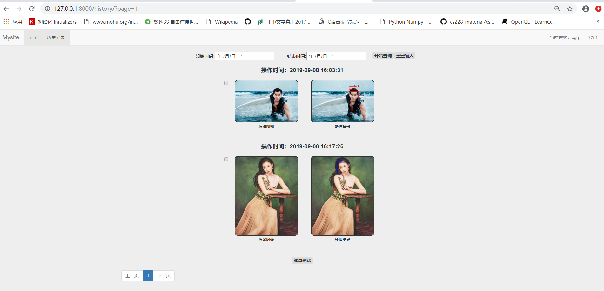

# 大作业文档

## 一、基本说明

### 1.环境

项目开发使用 conda 环境，主要为了包管理的方便以及 python 版本原因。运行项目时，只需要当前环境中安装了必需的依赖项即可。

### 2.依赖项

> - python == 3.6.8
> - Django == 2.2.5
> - Keras == 2.0.5
> - opencv-python == 3.2.0.8
> - numpy == 1.17.1
> - pandas == 0.19.1
> - Pillow == 6.1.0
> - tensorflow == 1.14.0
> - statistics == 1.0.3.5
> - requests == 2.22.0
> - h5py == 2.7.0
> - scipy == 1.3.1

均使用 pip 安装。

### 3.模型

深度学习模型来自于 github 项目：
地址为：[点击此处跳转](https://github.com/oarriaga/face_classification)。  
采用了三个简单的网络实现人脸的检测以及检测到人脸之后的性别和表情识别。

### 4.组队信息

个人完成

> 学号：2016010579  
> 姓名：陈刚

---

## 二、整体项目结构

项目名称是 FinalProject。App 名称是 WebCNN。  
FinalProject(蓝色)中包括一些基础设置以及 url 设置。  
media 文件夹保存着用户上传的文件(origin)以及最后的结果(reulsts)。  
static 文件夹中有一些 CSS,JS 文件用于 html 的渲染。  
templates 文件夹中是一些 html 模板页面。  
WebCNN 中的 src 文件夹中有预训练好的网络文件。  
WebCNN 中的 python 文件如 views，models,detection,forms 实现了主要的逻辑和大部分功能。

---

## 三、部署以及网页截图：

### 1.注册页面

在 pycharm 中运行项目后(注意需要先使用 manage.py 实现数据库的迁移)，在浏览器中(建议使用 chrome)输入地址 [http://127.0.0.1:8000/logon/](http://127.0.0.1:8000/logon/) 即可访问注册界面。或者点击界面上的"注册"也能跳转。如下所示：

具体端口以 pycharm 控制台输出为准：

在框中输入用户名以及密码即可实现注册功能，同时需要满足：

> 用户名：只能包括 "0 ~ 9, a - z, A - Z , _" 的字符，且不能为空。   
> 密码：长度为 6~16 且不能包括空白符。

输入框中有相应提示，且会拒绝不合法输入。

---

### 2.登陆页面

注册成功后，会自动跳转至登陆页面，直接在浏览器中输入地址[http://127.0.0.1:8000/login/](http://127.0.0.1:8000/login/)也能访问。或者点击界面上的"登陆"也能跳转。登陆界面如下所示：

使用已经注册成功的用户名和密码可以实现登陆。

---

### 3.处理界面

登陆成功后，会自动跳转至处理界面，在已经登陆的情况下在浏览器中输入[http://127.0.0.1:8000/index/](http://127.0.0.1:8000/index/)也能跳转至该页面。或者点击界面上的"主页"也能跳转。处理界面如下所示：

在处理界面有两种方式上传图片进行处理：选取本地图片或者使用图片 URL。点击提交按钮，就可以对图片进行处理，在大约 1~2s 后页面会返回结果以及相应的提示信息。如下所示：

左图显示了上传的原始图像，右边则是人脸识别、性别分类以及表情分类的结果。原图以及处理结果图片的相关信息都被存储起来。

---

### 4.历史记录界面

在浏览器中输入[http://127.0.0.1:8000/history/](http://127.0.0.1:8000/history/)即可访问操作历史记录界面。或者点击界面上的"历史记录"也能访问。如下所示：

为了显示全部的组件，以上网页使用了缩放。历史记录界面显示了当前用户所有操作过的图片以及相应的处理结果。默认每个界面显示四条历史记录，不足的显示全部。点击图片前的复选框，再点击最下方的批量删除按钮可以实现批量删除。只勾选一个复选框就可以单条删除。最下方的组件可以实现翻页操作。同时页面上方的搜索组件可以输入查询时间，点击开始查询就可以得到所有满足条件的记录。
查询操作如下所示：

---

### 5.登出界面

在浏览器搜索框中输入[http://127.0.0.1:8000/logout/](http://127.0.0.1:8000/logout/)或者点击任何界面上的"登出"即可实现退出登陆。登出后会自动跳转到登陆界面

---

### 6.其他界面

在浏览其中输入不合法 url 会返回 404 页面，服务器错误会返回 500 界面。以下展示 404 界面。

---

## 四、推荐功能的实现：

- 每一个接口都对用户的身份进行了检查，详情请见具体代码，如果查询不到 session 中的用户登陆状态，html 模板页面会给出提示信息。
- 用户可以通过传入图片 HTTP 网址的方式给后台识别，如处理界面所示。同时后台会判断该 url 基本格式是否正确、url 是否以.jpg/.jpeg 结尾、实际下载的文件是否是图像等等。在满足条件的情况下进行下载处理，返回结果。
- 提供了按时间段查询历史记录的功能，如历史记录界面所示。同时实现了批量删除的功能，删除记录的同时会删除数据库中的记录以及存储的图片。
- 实现了管理员功能
